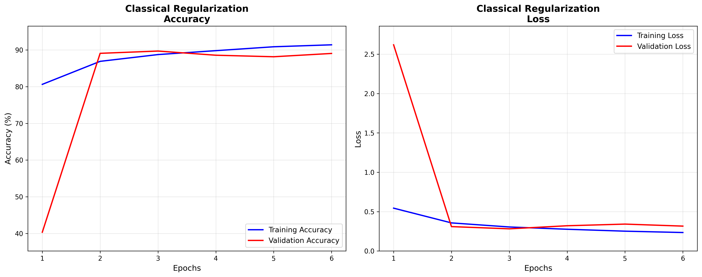
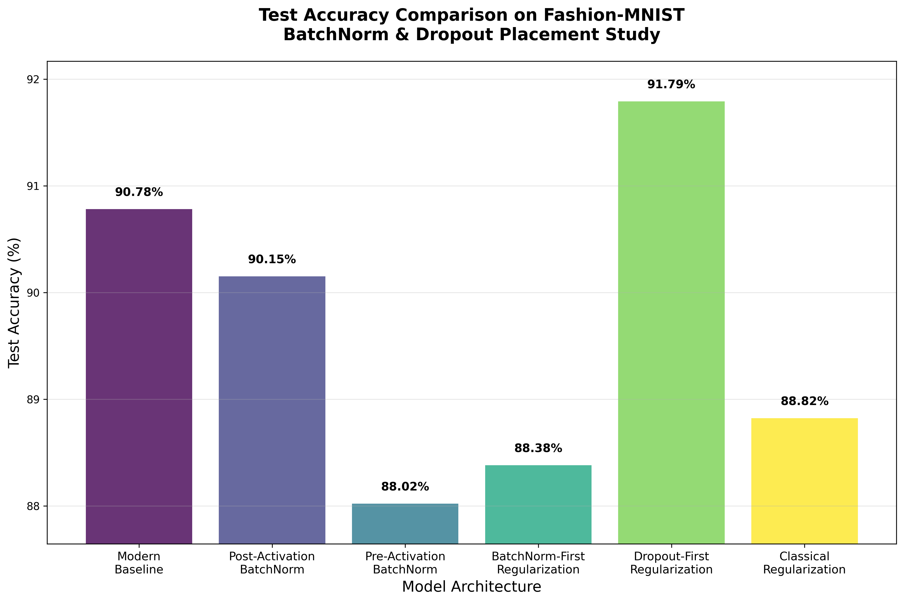

# CNN BatchNorm & Dropout Placement Study

[](https://www.python.org/)
[](https://tensorflow.org/)
[](LICENSE)
[](https://github.com/Net-AI-Git/02---cnn-BatchNorm-and-Dropout)

A systematic empirical study investigating the effects of BatchNormalization and Dropout placement in deep Convolutional Neural Networks using Fashion-MNIST dataset.

## 📋 Table of Contents

- [Description](#description)
- [Technologies Used](#technologies-used)
- [Installation](#installation)
- [Usage](#usage)
- [Project Structure](#project-structure)
- [Research Methodology](#research-methodology)
- [Results](#results)
- [Future Work](#future-work)
- [License](#license)
- [Author](#author)

## 🎯 Description

This project presents a controlled comparative study of regularization techniques in CNN architectures, specifically examining:

- **BatchNormalization placement**: Pre-activation vs. Post-activation patterns
- **Dropout positioning**: Before vs. After BatchNorm layers
- **Combined regularization strategies**: Optimizing layer ordering for better generalization

The study implements 6 distinct CNN architectures on Fashion-MNIST, providing insights into regularization technique effectiveness and optimal placement strategies for improved model performance.

**Key Research Questions:**
1. How does BatchNorm placement (pre vs post-activation) affect convergence speed?
2. What is the optimal order of BatchNorm and Dropout operations?
3. Which regularization strategy provides the best generalization performance?

## 🛠️ Technologies Used

- **Python** 3.8+
- **TensorFlow** 2.x / **Keras** for deep learning
- **NumPy** for numerical computations
- **Matplotlib** for visualization
- **scikit-learn** for data preprocessing
- **Fashion-MNIST** dataset

## 🚀 Installation

### Prerequisites
- Python 3.8 or higher
- pip package manager

### Setup

1. Clone the repository:
```bash
git clone https://github.com/Net-AI-Git/02---cnn-BatchNorm-and-Dropout.git
cd 02---cnn-BatchNorm-and-Dropout
```

2. Install dependencies:
```bash
pip install -r requirements.txt
```

### Requirements.txt
```
tensorflow>=2.8.0
numpy>=1.21.0
matplotlib>=3.5.0
scikit-learn>=1.0.0
```

## 📖 Usage

### What the Script Does

1. **Data Preparation**: Loads Fashion-MNIST with stratified train/validation split
2. **Model Training**: Trains 6 different CNN architectures with early stopping
3. **Evaluation**: Tests each model and records performance metrics
4. **Visualization**: Generates training plots and comparison charts
5. **Analysis**: Provides comprehensive performance summary

### Expected Output

The script will create a `Fashion_MNIST_Research_Results/` directory containing:
- 6 individual training plots (accuracy + loss curves)
- 1 final comparison plot
- Console output with detailed performance metrics

### Customization

Key parameters can be modified in the `CNNResearchPipeline` class:

```python
self.epochs = 12           # Maximum training epochs
self.batch_size = 128      # Training batch size
self.validation_split = 0.2 # Validation set proportion
```

## 📁 Project Structure

```
02---cnn-BatchNorm-and-Dropout/
├── cnn_keras.py                    # Main research pipeline
├── requirements.txt                # Project dependencies
├── README.md                      # Project documentation
├── LICENSE                        # MIT License
└── Fashion_MNIST_Research_Results/ # Generated results (after running)
    ├── 1_Modern_Baseline_Training.png
    ├── 2_Post_Activation_BatchNorm_Training.png
    ├── 3_Pre_Activation_BatchNorm_Training.png
    ├── 4_BatchNorm_First_Regularization_Training.png
    ├── 5_Dropout_First_Regularization_Training.png
    └── Final_Test_Accuracy_Comparison.png
```

## 🔬 Research Methodology

### Model Architectures

1. **Modern Baseline**: 4-layer CNN without regularization (control group)
2. **Post-Activation BatchNorm**: Conv → ReLU → BatchNorm pattern
3. **Pre-Activation BatchNorm**: Conv → BatchNorm → ReLU pattern  
4. **BatchNorm-First**: Conv → BatchNorm → ReLU → Dropout sequence
5. **Dropout-First**: Conv → ReLU → Dropout → BatchNorm sequence
6. **Classical Regularization**: Conv → ReLU → BatchNorm → Dropout sequence

### Experimental Setup

- **Dataset**: Fashion-MNIST (28×28 grayscale, 10 classes)
- **Training Strategy**: Early stopping with patience=3
- **Data Split**: Stratified 80/20 train/validation split
- **Architecture**: Progressive filter increase (32→64→128→256)
- **Optimization**: Adam optimizer with categorical crossentropy loss

### Evaluation Metrics

- Test accuracy on held-out test set
- Training convergence speed (epochs to convergence)
- Generalization gap (training vs. validation performance)
- Parameter efficiency analysis

## 📊 Results

### Training Performance Visualization

*[Insert training plots here after running the experiment]*

#### Individual Model Training Results:




### Comparative Analysis:


### Key Findings

*[Results will be populated after running the experiment]*

Expected insights:
- Regularization impact on overfitting reduction
- Convergence speed differences between architectures  
- Optimal regularization technique for Fashion-MNIST classification
- Performance vs. parameter efficiency trade-offs

## 🔮 Future Work

### Potential Extensions

- **Deeper Architectures**: Extend study to ResNet-style architectures
- **Additional Datasets**: Validate findings on CIFAR-10/100
- **Advanced Regularization Techniques**: 
  - L2 Weight Decay (kernel regularization)
  - DropBlock for spatial regularization
  - Label Smoothing for overconfidence reduction
  - L1/ElasticNet regularization for sparsity
- **Hyperparameter Optimization**: Systematic search for optimal dropout rates
- **Statistical Significance**: Multiple runs with confidence intervals

### Implementation Improvements

- Automated hyperparameter tuning with Optuna
- Model checkpointing for resumable training
- Distributed training support for larger models

## 📄 License

This project is licensed under the MIT License - see the [LICENSE](LICENSE) file for details.

## 👨‍💻 Author

**Netanel Itzhak**
- 🔗 LinkedIn: [linkedin.com/in/netanelitzhak](https://www.linkedin.com/in/netanelitzhak)
- 📧 Email: ntitz19@gmail.com
- 🐙 GitHub: [Net-AI-Git](https://github.com/Net-AI-Git)

---

### 🙏 Acknowledgments

- Fashion-MNIST dataset creators for providing a challenging alternative to MNIST
- TensorFlow/Keras team for excellent deep learning framework
- Research papers by Ioffe & Szegedy (2015) and He et al. (2016) for BatchNorm insights

---

*This project demonstrates practical application of regularization techniques in deep learning, providing empirical evidence for optimal architecture design decisions.*
