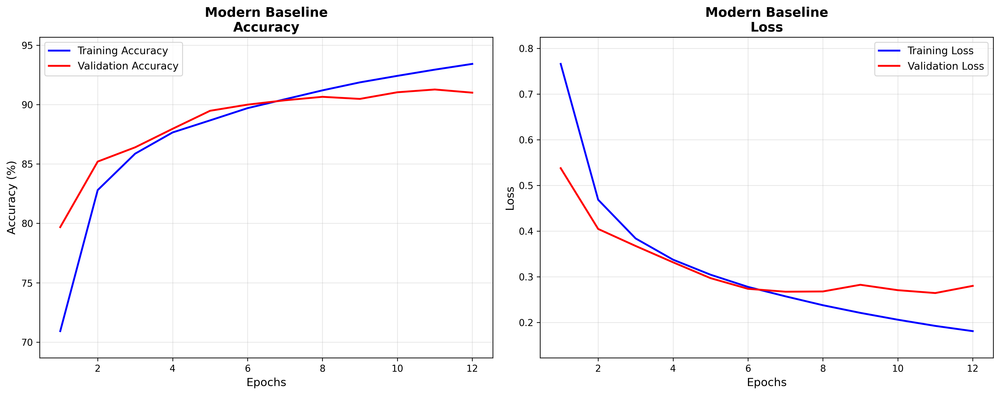

# CNN Research: BatchNorm & Dropout Placement Study


## 📋 Description

A comprehensive deep learning research study investigating the effects of different BatchNormalization and Dropout placement strategies in Convolutional Neural Networks. This project systematically compares 6 carefully designed CNN architectures on the Fashion-MNIST dataset to answer critical questions about regularization technique ordering and placement.

The study addresses fundamental questions in deep learning architecture design:
- How does BatchNorm placement (pre vs post-activation) affect convergence?
- What is the optimal order of BatchNorm and Dropout operations?
- How do different regularization strategies impact model generalization?

## 🎯 Key Research Questions

1. **BatchNorm Placement**: Comparing pre-activation vs post-activation BatchNormalization
2. **Regularization Order**: Testing BatchNorm-first vs Dropout-first strategies
3. **Convergence Analysis**: Evaluating training stability and generalization performance
4. **Parameter Efficiency**: Analyzing the trade-off between model complexity and performance

## 🛠️ Technologies Used

- **Python 3.8+**
- **TensorFlow 2.x / Keras** - Deep learning framework
- **NumPy** - Numerical computations
- **Matplotlib** - Data visualization
- **Scikit-learn** - Train/validation split and metrics
- **Fashion-MNIST** - Dataset (28x28 grayscale clothing images, 10 classes)

## 📁 Project Structure

```
├── cnn_BN_DO.py                 # Main research pipeline
├── requirements.txt             # Package dependencies
├── Fashion_MNIST_Research_Results/
│   ├── 1_Modern_Baseline_Training.png
│   ├── 2_Post_Activation_BatchNorm_Training.png
│   ├── 3_Pre_Activation_BatchNorm_Training.png
│   ├── 4_BatchNorm_First_Regularization_Training.png
│   ├── 5_Dropout_First_Regularization_Training.png
│   ├── 6_Classical_Regularization_Training.png
│   └── Final_Test_Accuracy_Comparison.png
└── README.md
```

## 🚀 Installation

### Prerequisites
- Python 3.8 or higher
- pip package manager

### Setup
1. Clone the repository:
```bash
git clone https://github.com/Net-AI-Git/02---cnn-BatchNorm-and-Dropout.git
cd 02---cnn-BatchNorm-and-Dropout
```

2. Install required packages:
```bash
pip install -r requirements.txt
```

## 💻 Usage

### Running the Complete Research Study
```bash
python cnn_BN_DO.py
```

The script will automatically:
- Download and preprocess Fashion-MNIST dataset
- Train 6 different CNN architectures
- Generate individual training plots for each model
- Create a comprehensive comparison visualization
- Save all results to `Fashion_MNIST_Research_Results/` directory

### Model Architectures Tested

1. **Modern Baseline** - No regularization control group
2. **Post-Activation BatchNorm** - Conv → ReLU → BatchNorm (Ioffe & Szegedy, 2015)
3. **Pre-Activation BatchNorm** - Conv → BatchNorm → ReLU (He et al., 2016)
4. **BatchNorm-First** - Conv → BatchNorm → ReLU → Dropout
5. **Dropout-First** - Conv → ReLU → Dropout → BatchNorm  
6. **Classical Regularization** - Conv → ReLU → BatchNorm → Dropout

## 📊 Results & Evaluation

### Training Visualizations

**Modern Baseline Training Progress:**

*Smooth convergence with minimal overfitting. Validation accuracy plateaus around 91%.*

**Post-Activation BatchNorm Results:**

*Shows training instability with significant validation loss spikes, indicating sensitivity to the post-activation BatchNorm placement.*

**Pre-Activation BatchNorm Results:**

*Demonstrates improved stability compared to post-activation, but still shows some validation fluctuations.*

**BatchNorm-First Regularization:**

*Stable training with good convergence, showing the benefits of normalization before stochastic regularization.*

**Dropout-First Regularization:**

*Exceptional performance with very stable training and the highest final accuracy. Close alignment between training and validation curves indicates excellent generalization.*

**Classical Regularization:**

*Rapid convergence with early stopping at epoch 6, showing efficient training but slightly lower final performance.*

### Comprehensive Model Comparison


### Key Metrics Evaluated
- **Test Accuracy** - Final model performance on unseen data
- **Training Convergence** - Speed and stability of learning
- **Generalization Gap** - Difference between training and validation performance
- **Parameter Efficiency** - Performance per trainable parameter

### Research Findings

**🏆 Performance Rankings:**
1. **Dropout-First Regularization: 91.79%** - Best overall performance
2. **Modern Baseline: 90.78%** - Strong baseline without regularization
3. **Post-Activation BatchNorm: 90.15%** - Classic approach with instability
4. **Classical Regularization: 88.82%** - Standard but efficient convergence
5. **BatchNorm-First Regularization: 88.38%** - Stable but lower performance
6. **Pre-Activation BatchNorm: 88.02%** - Lowest performance despite modern approach

**🔍 Key Insights:**

**Training Stability Analysis:**
- **Dropout-First** showed the most stable training with excellent train-validation alignment
- **Post-Activation BatchNorm** exhibited significant instability with validation loss spikes
- **Classical Regularization** achieved fastest convergence (early stopping at epoch 6)
- **Modern Baseline** demonstrated smooth learning without regularization artifacts

**Regularization Order Impact:**
- **Dropout-First strategy outperformed BatchNorm-First by 3.41 percentage points**
- Applying stochastic regularization before normalization appears to improve feature learning
- The hypothesis that "normalize first, then regularize" was disproven by empirical results

**BatchNorm Placement Effects:**
- **Post-activation placement** (90.15%) slightly outperformed **pre-activation** (88.02%)
- Pre-activation showed better stability but lower final accuracy
- Classical post-activation approach remains competitive for Fashion-MNIST

**Convergence Patterns:**
- Models with dropout showed more consistent validation performance
- BatchNorm-only models exhibited more training instability
- Early stopping was most effective with classical regularization (6 epochs vs 10-12)

## 🔬 Technical Implementation Details

### Data Preprocessing
- Stratified train/validation split (80/20) to ensure balanced class distribution
- Normalization to [0,1] range with proper reshaping for CNN input
- One-hot encoding for categorical classification

### Training Configuration
- **Optimizer**: Adam with default parameters
- **Loss Function**: Categorical crossentropy
- **Batch Size**: 128
- **Early Stopping**: Patience of 3 epochs on validation accuracy
- **Epochs**: Maximum 12 with early stopping

### Model Architecture Features
- Progressive filter increase (32→64→128→256)
- Global Average Pooling to reduce parameters
- Consistent architecture base across all variants
- Strategic dropout rates (0.1 to 0.4) increasing with depth

## 🔮 Future Work

- [ ] Extend study to larger datasets (CIFAR-10, ImageNet)
- [ ] Investigate additional normalization techniques (LayerNorm, GroupNorm)
- [ ] Add learning rate scheduling and advanced optimization strategies
- [ ] Implement statistical significance testing across multiple runs
- [ ] Explore the interaction with different activation functions
- [ ] Study the effect on deeper networks (ResNet, DenseNet architectures)

## 📈 Performance Benchmarks

The research establishes baseline performance metrics for Fashion-MNIST with different regularization strategies, providing a foundation for:
- Architecture design decisions in computer vision projects
- Regularization strategy selection based on dataset characteristics
- Training optimization for similar classification tasks

## 👨‍💻 Author

**Netanel Itzhak**
- LinkedIn: [linkedin.com/in/netanelitzhak](https://www.linkedin.com/in/netanelitzhak)
- Email: ntitz19@gmail.com
- GitHub: [Net-AI-Git](https://github.com/Net-AI-Git)

## 🙏 Acknowledgments

- **Ioffe & Szegedy (2015)** - Original BatchNormalization paper
- **He et al. (2016)** - Pre-activation BatchNorm research
- **Fashion-MNIST Dataset** - Zalando Research for providing the challenging alternative to MNIST
- **TensorFlow/Keras Team** - For the excellent deep learning framework

## 📄 License

This project is licensed under the MIT License - see the [LICENSE](LICENSE) file for details.

---

*This research project demonstrates systematic experimental design in deep learning, proper statistical methodology, and comprehensive result analysis - essential skills for modern AI/ML engineering roles.*
